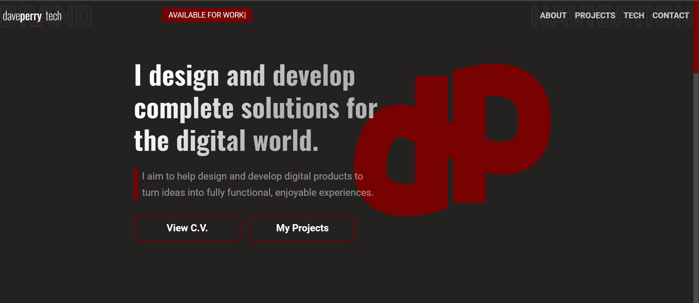

Project Link: [My Portfolio](https://daveperry.tech)

# Dave Perry

<!-- A little info about your project and/ or overview that explains **what** the project is about. -->

This is my personal portfolio to showcase some of my projects that I have both designed and developed. I have incorporated my more unique projects that I have built.

<!--
## Portfolio Details

Each player choses ten numbers (from available lotto numbers range). Mark off each of your numbers if the ball was drawn in the official lotto draw. The winner is the first person to match all ten numbers. -->

## Motivation

I wanted to do something creative as a job so I decided to leave my job and teach myself how to code. I have learnt a lot during my time studying and I am hoping that my projects will be enough to land me my first developer role.

I am always eager to learn more and improve on the last project.

## Code

Developed using Next.js. My portfolio displays my coding in React, animations in GSAP, styling with styled-components. It is deployed on Vercel and integrates with FormSpree for my Contact Form.

<!-- If you're using any code style like xo, standard etc. That will help others while contributing to your project. Ex. - -->
<!--  -->

<!-- ## Screenshots -->

<!-- Include logo/demo screenshot etc. -->

<!--  -->

<!-- ## Tech/framework used

Ex. -

<b>Built with</b>

- [Electron](https://electron.atom.io) -->

<!-- ## Features

What makes your project stand out? -->

## Future Features

I will update the UI each time I add new and better projects of mine to showcase. Some small additions will be:

- Theme Toggle
- More Animations
- MERN Projects

<!-- ## Code Example

Show what the library does as concisely as possible, developers should be able to figure out **how** your project solves their problem by looking at the code example. Make sure the API you are showing off is obvious, and that your code is short and concise. -->

<!-- ## Installation

Provide step by step series of examples and explanations about how to get a development env running. -->

<!-- ## API Reference

Depending on the size of the project, if it is small and simple enough the reference docs can be added to the README. For medium size to larger projects it is important to at least provide a link to where the API reference docs live.

## Tests

Describe and show how to run the tests with code examples. -->

<!-- ## Contribute

Let people know how they can contribute into your project. A [contributing guideline](https://github.com/zulip/zulip-electron/blob/master/CONTRIBUTING.md) will be a big plus. -->

<!-- ## Credits

Give proper credits. This could be a link to any repo which inspired you to build this project, any blogposts or links to people who contributed in this project.

#### Anything else that seems useful -->

## Contact

If you want to contact me you can reach me at [daveperry.tech](https://daveperry.tech)

<!-- [loopy lotto repo](https://github.com/your_username/repo_name) -->

## License

<!-- A short snippet describing the license (MIT, Apache etc) -->

Distributed under the MIT License. See [LICENSE](LICENSE.txt) for more information.

<!-- MIT © [Dave Perry]() -->
